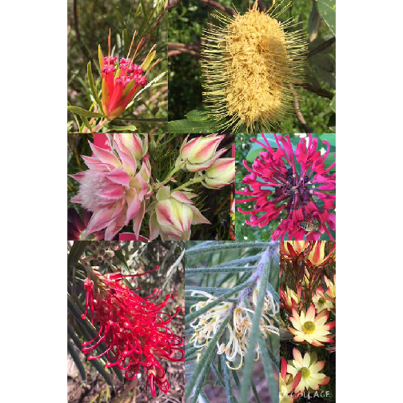
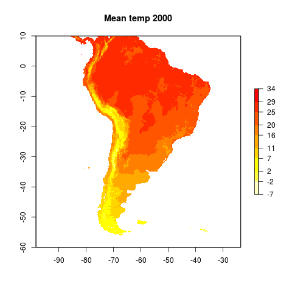
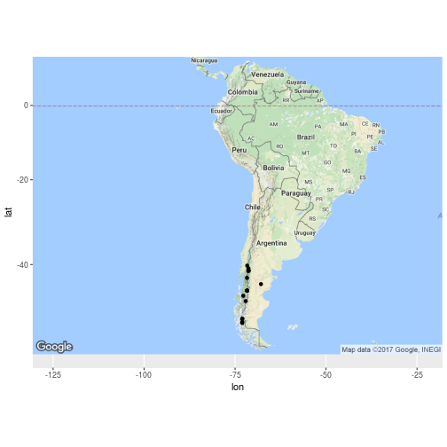

NetworkFlow
========================================================
author: Derek Corcoran
date: 
autosize: true

Slide With Plot
========================================================

Restricciones
========================================================

Encontrar las cadenas de disperción, para cada especie:

- Las cadenas no deben ser superpuestas (Dos cadenas no pueden usar la misma celda en el mismo año)
- Usar solo celulas no transformadas con proteccion existente o prpouesta 

- Tener al menos 35 cadenas, si no es posible, entonces el set con mayor numero de celdas posibles.

El numero de Celdas propuestas para proteccion debe ser el menor posible.

Slide With Code
========================================================

Slide With Code
========================================================

